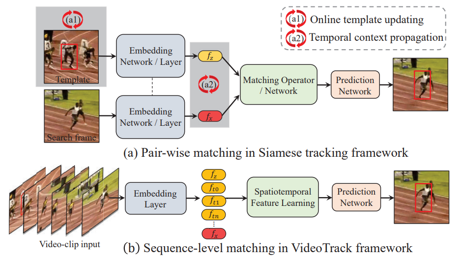
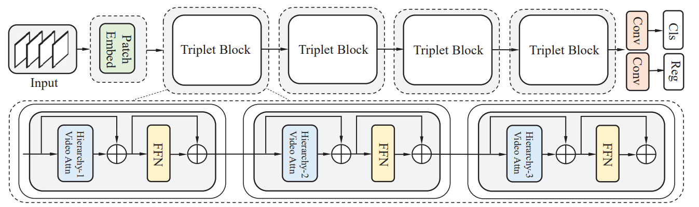

# VideoTrack

## VideoTrack: Learning to Track Objects via Video Transformer

### :star: Our paper is accepted by CVPR2023 !

```bibtex
Fei Xie, Lei Chu, Jiahao Li, Yan Lu and Chao Ma 

This work was done when Fei Xie was an intern at Microsoft Research Asia
```
### paper (https://openaccess.thecvf.com/content/CVPR2023/papers/Xie_VideoTrack_Learning_To_Track_Objects_via_Video_Transformer_CVPR_2023_paper.pdf) and demo videos 

paper [here](https://openaccess.thecvf.com/content/CVPR2023/papers/Xie_VideoTrack_Learning_To_Track_Objects_via_Video_Transformer_CVPR_2023_paper.pdf)  video [here](https://www.youtube.com/watch?v=v-SvFZ0FrF8&t=12s) 
 
## Highlights


Comparing to the pair-wise matching pipeline in
Siamese tracking shown in (a), which requires sophisticated mechanisms (a1)/(a2) to exploit temporal contexts, our neat video transformer tracking (VideoTrack) framework, as shown in (b), directly
lifts the pair-wise feature matching into spatiotemporal domain.


Overall architecture of video transformer model for tracking (VideoTrack). It is constructed by stacking multiple basic building units, named as triplet-block which consists of three hierarchical attention layers. Inside the each layer of triplet-block, video attention module mixes the multi-branch information flows among inputs asymmetrically. Then, the spatiotemporal learned features from search frame are fed to the prediction head for final target classification (Cls) and size regression (Reg). FFN denotes FeedForwad Network


## Abstract
Existing Siamese tracking methods, which are built on pair-wise matching between two single frames, heavily rely on additional sophisticated mechanism to exploit temporal information among successive video frames, hindering them from efficiency and industrial deployments. In this work, we resort to sequence-level target matching that can
encode temporal contexts into the spatial features through a neat feedforward video model. Specifically, we adapt the standard video transformer architecture to visual tracking by enabling spatiotemporal feature learning directly from frame-level patch sequences. To better adapt to the tracking task, we carefully blend the spatiotemporal information in the video clips through sequential multi-branch triplet blocks, which formulates a video transformer backbone. Our experimental study compares different model variants, such as tokenization strategies, hierarchical structures, and video attention schemes. Then, we propose a disentangled dual-template mechanism that decouples static and dynamic appearance clues over time, and reduces temporal redundancy in video frames. Extensive experiments show that our method, named as VideoTrack, achieves state-of-the-art results while running in real-time.


## Citing VideoTrack
If you find VideoTrack useful in your research, please consider citing:
```bibtex
@inproceedings{xie2023videotrack,
  title={VideoTrack: Learning To Track Objects via Video Transformer},
  author={Xie, Fei and Chu, Lei and Li, Jiahao and Lu, Yan and Ma, Chao},
  booktitle={Proceedings of the IEEE/CVF Conference on Computer Vision and Pattern Recognition},
  pages={22826--22835},
  year={2023}
}

```

